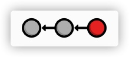

## 1、介绍（Introduction）
 Git是为单个任务创建的版本控制系统（VCS）：管理文件更改。 它使您可以跟踪软件项目经历的每个更改以及这些更改来自何处。 这使Git成为管理大型项目的必不可少的工具，但它也可以为您的个人工作流打开各种可能性。
###  修订控制简史
稍后我们将详细讨论Git背后的核心理念，但首先，让我们逐步了解整个版本控制系统的发展。
##### 文件和文件夹
在版本控制软件出现之前，只有文件和文件夹。 跟踪项目修订的唯一方法是复制整个项目并为其重新命名。 只需考虑一下您保存了一次名为my-term-paper-2.doc的“备份”。 这是版本控制的最简单形式。

但是，很容易看出，如何将文件夹之间的文件复制对软件开发人员造成灾难性的影响。 如果给文件夹贴错标签会怎样？ 或者，如果您覆盖了错误的文件？ 您甚至怎么会知道丢失了重要的一段代码？ 软件开发人员很快就意识到他们需要更可靠的东西。
##### 本地VCS
因此，开发人员开始编写专用于管理文件修订的实用程序。 这些新的VCS不再将旧版本保留为独立文件，而是将它们存储在数据库中。 当需要查看旧版本时，可以使用VCS而不是直接访问文件。 这样，您在任何给定的“时间”都将只有一个项目的“检出”副本，从而避免了混淆或丢失修订的可能性。

“目前，版本控制仅在开发人员的本地计算机上进行，无法在多个程序员之间有效地共享代码。
##### 集中式VCS
输入集中式版本控制系统（CVCS）。 这些新的CVCS程序无需将项目历史记录存储在开发人员的硬盘上，而是将所有内容存储在服务器上。 开发人员检出文件，并通过网络将其保存回项目中。 这种设置使几个程序员可以通过给他们一个单一的入口点来在一个项目上进行协作。

&#160; &#160; &#160;&#160; &#160; &#160;&#160; &#160; &#160;&#160; &#160; &#160;&#160; &#160; &#160;&#160; &#160; &#160;集中版本控制

虽然对本地VCS进行了重大改进，但集中式系统带来了一系列新问题：多个用户如何同时处理同一个文件？ 想象一下一个场景，两个人修复了相同的错误，然后尝试将其更新提交到中央服务器。 应该接受谁的更改？

CVCS通过防止用户覆盖他人的工作来解决此问题。 如果两个更改冲突，则必须有人手动插入并合并差异。 该解决方案适用于更新相对较少的项目（这意味着冲突相对较少），但是对于项目而言却很麻烦许多活跃的贡献者每天都会提交一些更新：直到所有合并冲突都解决并提供给整个开发团队之后，开发才能继续进行。
##### 分布式VCS
下一代版本控制程序从单一集中式存储库的概念转移到其他位置，而是选择为每个开发人员提供整个项目的本地副本。 由此产生的分布式存储库网络使每个开发人员都可以像本地VCS一样独立工作，但是现在CVCS的冲突解决问题有了更优雅的解决方案。

&#160; &#160; &#160;&#160; &#160; &#160;&#160; &#160; &#160;&#160; &#160; &#160;&#160; &#160;分布式版本控制
“由于不再有中央存储库，因此每个人都可以按照自己的进度进行开发，将更新存储在本地，并推迟合并冲突，直到方便为止。此外，分布式版本控制系统（DVCS）专注于对单独的开发分支进行有效管理，这使得共享代码，合并冲突以及尝试新想法变得更加容易。

由于您不再需要通过网络执行操作，因此DVCS的本地性也使开发更快。而且，由于每个用户都有项目的完整副本，因此服务器崩溃，存储库损坏或任何其他类型的数据丢失的风险比其CVCS以前的版本要低得多。

#### Git的诞生
因此，我们来到了Git，这是一个分布式版本控制系统，用于管理Linux内核。 2005年，Linux社区失去了其自2002年以来一直使用的商业DVCS BitKeeper软件的免费许可。作为回应，Linus Torvalds提倡开发新的开源DVCS作为替代产品。这就是Git的诞生。

作为整个Linux内核的源代码管理器，Git有几个独特的约束，包括：
* 可靠性
* 大型项目的高效管理
* 支持分布式开放
* 支持非线性开放

尽管当时确实存在其他DVCS（例如GNU的Arch或David Roundy的Darcs），但它们都无法满足这种功能组合。在这些目标的推动下，Git进行了积极的开发已有数年，现在它具有很大的稳定性，知名度和社区参与性。

Git最初是一个命令行程序，但是多年来，已经发布了各种可视界面。图形工具掩盖了Git背后的某些复杂性，并且通常使可视化存储库的状态更为容易，但是它们仍然需要在分布式版本控制中扎实的基础。考虑到这一点，我们将坚持使用命令行界面，这仍然是与Git交互的最常用方法。

## 安装
即将发布的模块将通过将命令应用于实际场景来探索Git的功能。但是首先，您需要可以正常运行的Git安装进行试验。可通过Git[官方网站](https://git-scm.com)获得所有受支持平台的下载。
对于Windows用户，这将安装一个名为Git Bash的特殊命令外壳。您应该使用此Shell而不是本机命令提示符来运行Git命令外壳。您应该使用此Shell而不是本机命令提示符来运行Git命令”版本。它应该输出类似git版本1.7.10.2（Apple Git-33）的信息。

#### 做好准备！
请记住，Ry的Git教程旨在演示Git的功能集，而不仅是为您简要介绍最常用的命令。 为了充分利用本教程，实际执行您正在阅读的命令很重要。 因此，请确保您坐在计算机前，然后开始吧！”


# 基础
现在，您已经对版本控制系统有了基本的了解，我们可以开始尝试使用Git。将Git用作VCS就像处理普通软件项目一样。您仍在用文件编写代码并将这些文件存储在文件夹中，直到现在您才可以访问大量的Git命令来操纵这些文件。

例如，如果您想还原到项目的先前版本，您所要做的就是运行一个简单的Git命令。该命令将深入Git的内部数据库，弄清楚您的项目在所需状态下的状态，并更新项目文件夹（也称为工作目录）中的所有现有文件。从外部的角度来看，您的项目看起来像是神奇地回到了过去。

本模块探索基本的Git工作流程：创建存储库，暂存和提交快照，配置选项以及查看存储库的状态。它还介绍了HTML网站，该网站是整个教程的运行示例。 HTML和CSS的非常基础的知识将使您对各种Git命令的基本目的有更深入的了解，但不是严格要求
#### 创建示例站点
在执行任何Git命令之前，我们需要创建示例项目。 创建一个名为my-git-repo的新文件夹以存储项目，然后向其中添加一个名为index.html的文件。 在您喜欢的文本编辑器中打开index.html，然后添加以下HTML。
```
<!DOCTYPE html>
<html lang="en">
<head>
  <title>A Colorful Website</title>
  <meta charset="utf-8" />
</head>
<body>
  <h1 style="color: #07F">A Colorful Website</h1>
  <p>This is a website about color!</p>    
  
  <h2 style="color: #C00">News</h2>
  <ul>
    <li>Nothing going on (yet)</li>
  </ul>
</body>
</html>”
```
完成后保存文件。 这是我们示例项目的基础。 随时在网络浏览器中打开index.html，以查看其转换为哪种网站。 它并不完全漂亮，但可以满足我们的目的。
#### 初始化一个库
创建一个git库，打开命令终端
```
# mkdir my-git-repo
```
如果您创建当前目录，您请执行：
```
# cd my-git-repo
```
下一步，运行以下命令将目录转换为Git存储库
```
# git init 
```
这将初始化存储库，从而启用Git的其余强大功能。 请注意，my-git-repo中现在有一个.git目录，用于存储我们存储库的所有跟踪数据（您可能需要启用隐藏文件才能查看此文件夹）。 .git文件夹是Git存储库和普通文件夹之间的唯一区别，因此，删除它会将您的项目还原为未版本控制的文件集合。
```
my-git-repo]# ls -a
.  ..  .git
```
查看存储库的状态
```
my-git-repo]# git status 
```
输出以下内容
```
# 位于分支 master
#
# 初始提交
#
# 未跟踪的文件:
#   （使用 "git add <file>..." 以包含要提交的内容）
#
#	index.html
提交为空，但是存在尚未跟踪的文件（使用 "git add" 建立跟踪）
```
暂时忽略了On分支母版部分，此状态消息告诉我们我们正在进行初始提交，除了“未跟踪的文件”之外，我们没有其他提交。

未跟踪的文件是不受版本控制的文件。 Git不会自动跟踪文件，因为经常有一些我们不希望受到修订控制的项目文件。 其中包括由C程序创建的二进制文件，这些二进制文件已编译为Python模块（.pyc文件），以及任何其他不必要地使存储库膨胀的内容。 为了使项目规模小且效率高，您应该仅跟踪源文件，并忽略可以从这些文件生成的任何内容。 后面的内容是构建过程的一部分，而不是版本控制。
#### 存储快照
因此，我们需要明确告诉Git将index.html添加到存储库。 恰当命名的git add命令告诉Git开始跟踪index.html：
```
my-git-repo]# git add index.html
my-git-repo]# git status 
```
代替“未跟踪的文件”列表，您应该看到以下状态。
```
# 位于分支 master
#
# 初始提交
#
# 要提交的变更：
#   （使用 "git rm --cached <file>..." 撤出暂存区）
#
#	新文件：    index.html
#
```
我们刚刚将index.html添加到快照中，以进行下一次提交。 快照表示您在给定时间点的项目状态。 在这种情况下，我们创建了一个快照，其中包含一个文件：index.html。 如果我们曾经告诉过Git，请恢复到这个快照,它将用这个文件替换整个项目文件夹，其中包含与现在完全相同的HTML。

Git创建快照的术语称为暂存，因为我们可以在实际将其提交到项目历史记录之前添加或删除多个文件。 暂存使我们有机会将相关更改分组为不同的快照，这种做法使跟踪软件项目有意义的进展成为可能（而不仅仅是任意代码行）
#### 提交快照
我们已经上演了快照，但是我们仍然需要将其提交到项目历史记录。 下一条命令将打开一个文本编辑器，并提示您输入提交消息。
```
my-git-repo]# git commit
```
为消息键入创建索引页面，保留其余文本，保存文件，然后退出编辑器。 您应该看到消息1文件在混乱的输出中更改了。 此更改的文件是我们的index.html。

正如我们刚刚演示的那样，保存项目的版本是一个两步过程：
1.分阶 告诉Git下一次提交要包含哪些文件。
2.提交 用描述性消息记录暂存的快照。
使用git add命令暂存文件实际上不会以任何重大方式影响存储库，它只是让我们获取文件以进行下一次提交。 只有执行git commit之后，我们的快照才会记录在存储库中。 提交的快照可以视为项目的“安全”版本。 Git永远不会改变它们，这意味着您几乎可以对项目做任何事情而不会丢失那些“安全”的修订。 这是任何版本控制系统的主要目标。

&#160; &#160; &#160;&#160; &#160; &#160;&#160; &#160; &#160;&#160; &#160; &#160;&#160; &#160;&#160; &#160; &#160;&#160; &#160; &#160;&#160; &#160; &#160;阶段/提交过程
查看存储库历史记录
```
# git log
```
当您执行此命令时，Git将输出有关我们唯一的提交的信息，会显示如以下信息：
```
commit 96e7daec537f22618799bfa6c0ecafac8efb1816
Author: root <root@localhost.localdomain>
Date:   Fri Dec 18 16:48:33 2020 +0800

    first commit
```
让我们分解一下。 首先，使用非常大且看起来非常随机的字符串（96e7daec5 ...）来识别提交。 这是提交内容的SHA-1校验和，可确保在Git不了解提交的情况下，提交不会被破坏。 由于提交的日期和作者不同，因此所有SHA-1校验和都将与本教程中显示的校验和不同。 在下一个模块中，我们将了解校验和如何同时用作提交的唯一ID。

接下来，Git显示提交的作者。 但是由于我们还没有告诉Git我们的名字，它只是显示未知的用户名。 Git还会输出提交发生的日期，时间和时区（-0600）。 最后，我们看到在上一步中输入的提交消息。
#### 配置Git
在提交更多快照之前，我们可能应该告诉Git我们是谁。 我们可以使用git config命令来做到这一点：
```
git config --global user.name "Your Name"
git config --global user.email you@example.com
```
#### 创建新的HTML文件
让我们继续开发我们的网站。 首先创建一个名为orange.html的文件，其中包含以下内容。
```
<!DOCTYPE html>
<html lang="en">
<head>
  <title>The Orange Page</title>
  <meta charset="utf-8" />
</head>
<body>
  <h1 style="color: #F90">The Orange Page</h1>
  <p>Orange is so great it has a”

style="color: #F90">fruit</span> named after it.</p>
</body>
</html>
```
然后再添加一个blue.html页面：
```
<!DOCTYPE html>
<html lang="en">
<head>
  <title>The Blue Page</title>
  <meta charset="utf-8" />
</head>
<body>
  <h1 style="color: #00F">The Blue Page</h1>
  <p>Blue is the color of the sky.</p>
</body>
</html>
```
#### 暂存新文件
我们可以按照创建第一个快照的相同方式暂存文件

```
my-git-repo]# git add blue.html orange.html
my-git-repo]# git status
```
请注意，我们可以将多个文件传递给git add。 添加文件后，您的状态输出应如下所示：
```
# 位于分支 master
# 要提交的变更：
#   （使用 "git reset HEAD <file>..." 撤出暂存区）
#
#	新文件：    blue.html
#	新文件：    orange.html
#

```
尝试运行git log。 它仅输出第一次提交，这告诉我们blue.html和orange.html尚未添加到存储库的历史记录中。 记住，我们可以看到带有git status的分阶段更改，但是没有看到git log。 后者仅用于已落实的更改.

让我们提交到暂存区
```
my-git-repo]# git commit -am "add blue.html orange.html
```
每个圆圈表示提交，红色圆圈指定我们当前正在查看的提交，箭头指向前面的提交。最后一部分可能看起来有悖常理，但它反映了提交之间的基本关系（也就是说，新提交是指其父提交）。在本教程中，您将多次看到这种类型的图表。
#### 修改HTML页面
我们用于暂存新文件的git add命令也可以用于暂存已修改的文件。 在</ body>标记之前，将以下内容添加到index.html的底部：
```
<h2>Navigation</h2>
<ul>
 style="color: #F90">
    <a href="orange.html">The Orange Page</a>
  </li>
  <li style="color: #00F">
    <a href="blue.html">The Blue Page</a>
  </li>
</ul>
```
下一步，在orange.html与blue.html添加下面这一行
```
<p><a href="index.html">Return to home page</a></p> 
```
提交快照
再一次，我们将进行修改，然后提交快照
```
my-git-repo]# git status 
my-git-repo]# git add index.html orange.html blue.html
my-git-repo]# git status
my-git-repo]# git commit -m "add navigation links"
```
-m选项使您可以在命令行上指定提交消息，而不用打开文本编辑器，这只是一个方便的快捷方式。
我们的历史现在可以表示如下。请注意，每次提交新快照时，代表当前提交的红色圆圈会自动向前移动
 
浏览存储库的历史记录
```
my-git-repo]# git log --oneline
```
想查看某个文件提交的历史记录；注意这里显示blue.html文件的提交信息
```
my-git-repo]# git log --oneline blue.html 
```
## <font color=#Crimson>结论</font>
在本模块中，我们介绍了基本的Git工作流程：


编辑文件，暂存快照并提交快照。 我们还对该过程中涉及的组件有一些亲身实践的经验：工作目录，暂存快照和已提交快照之间的区别是Git版本控制的核心。 几乎所有其他Git命令都以某种方式操纵这些组件之一，因此了解它们之间的相互作用是掌握Git的绝妙基础。

下一个模块通过还原到以前的快照来使我们现有的项目历史记录起作用。 这就是您开始将Git用作您自己项目的简单版本控制工具所需要的.
## <font color=#Crimson>快速参考</font>
<font size="4">git init </font>
在当前文件夹中创建一个Git存储库
git status 
<font size="4">查看存储库中每个文件的状态</font>
git add <file>
<font size="4">暂存文件以进行下一次提交</font>
git commit 
<font size="4">用描述性消息提交暂存文件</font>
git log 
<font size="4">查看存储库的提交历史记录</font>
git config --global user.name "<name>"
<font size="4">定义要在所有存储库中使用的作者名称</font>
git config --global user.email <email>
<font size="4">定义要在所有存储库中使用的作者电子邮件</font>

## <font color=#Crimson>撤销更改</font>
显示提交校验和
```
[root@CT102 my-git-repo]# git log --oneline 
```
输出应类似以下内容，但包含不同的提交校验和。Git仅输出校验和的前7个字符，前几个字符有效地充当了每次提交的唯一ID
```
0d071a4 add navigation links
f0a09db orange.html blue.html
073e168 index.html
```
### <font color=#Crimson>查看旧版本</font>
使用新的git checkout命令，我们可以查看先前快照的内容
```
my-git-repo]# git checkout 0d071a4
```
这将输出很多有关分离的HEAD状态的信息，运行git log还会告诉我们，第三次提交不再是项目的一部分。
### <font color=#Crimson>返回当前版本</font>
我们可以使用相同的git checkout命令返回master分支
```
my-git-repo]# git checkout master
```
这使Git更新了我们的工作目录，以反映主分支快照的状态。 它会为我们重新创建blue.html和orange.html文件，同时index.html的内容也会更新。 现在，我们回到了项目的当前状态，我们的历史记录如下：

#### <font color=#Crimson>标记发布</font>
我们称其为示例网站的稳定版本，我们可以通过用版本号标记最近的提交来使其正式版本；
```
my-git-repo]# git tag -a v1.0 -m "stable verison of the website"
```
-a标识告诉Git创建一个带注释的标签，该标签使我们可以记录我们的名称，日期和描述性消息，-m标识指定
#### <font color=#Crimson>实 验</font>
创建新的crazy.html文件

```
<!DOCTYPE html>
<html lang="en">
<head>
  <title>A Crazy Experiment</title>
  <meta charset="utf-8" />
</head>
<body>
  <h1>A Crazy Experiment</h1>
  <p>We're trying out a <span style="color: #F0F">crazy</span>
  <span style="color: #06C">experiment</span>!

  <p><a href="index.html">Return to home page</a></p>
</body>
</html>
```
提交到暂存区

```
my-git-repo]# git add crazy.html 
my-git-repo]# git status 
# 位于分支 master
# 要提交的变更：
#   （使用 "git reset HEAD <file>..." 撤出暂存区）
#git
#	新文件：    crazy.html
#
my-git-repo]# git commit -m "add a crazy.html"
my-git-repo]# git log
```
查看稳定版本

```
# git checkout v1.0
```
在撤销前我们需要切换到master分支

```
# git checkout master
```
查看提交历史记录

```
# git log --oneline
eec2666 add www
01d8bb6 add crazy.htnl
c3fd427 add blue.html orange.html
2e186b4 11
96e7dae first commit
```

撤销已提交的更改（删除最近的提交来恢复原来的版本）

```
# git revert eec2666
```
查看操作的历史记录

```
# git log --oneline
72e395e Revert "add www"
eec2666 add www
01d8bb6 add crazy.htnl
c3fd427 add blue.html orange.html
2e186b4 11
96e7dae first commit
```
开始一个小的实验
创建一个dum-my.html

```
<h2>Navigation</h2>
<ul>
  <li style="color: #F90">
    <a href="orange.html">The Orange Page</a>
  </li>
  <li style="color: #00F">
    <a href="blue.html">The Blue Page</a>
  </li>
  <li>
    <a href="dummy.html">The Dummy Page</a>
  </li>
</ul>
```
撤销未提交的更改（再开始操作前我们先查看存储库的状态）

```
my-git-repo]# git status 
# 位于分支 master
# 未跟踪的文件:
#   （使用 "git add <file>..." 以包含要提交的内容）
#
#	dum-my.html
提交为空，但是存在尚未跟踪的文件（使用 "git add" 建立跟踪）
```
提示我们有一个需要更改的跟踪文件和未跟踪文件

```
my-git-repo]# git reset --hard
```
这将更改所有跟踪的文件以匹配最新的提交，--hard标志是实际跟新文件的内容，如果不带任何标志运行git reset将会简单的取消索引index.html使内容保持原样。
我们删除dum-my.html文件。当然我们可以手动将其删除，但是在大型团队中使用多个文件时，使用Git重置更改可以消除认为错误，运行以下命令

```
my-git-repo]# git clean -f
正删除 dum-my.html
```
Git reset和git clean 两者都在工作目录上运行，而不是在已提交的快照上运行。与git revert不同，他们会永久撤销更改，因此请确保在使用他们之前确实要丢弃正在处理的内容
### <font  color=Crimson>结论</font>
大多数Git命令在Git存储库的三个主要组件之一上运行：工作目录，暂存快照或已提交快照。
git reset命令撤销对工作目录和暂存快照的更改，而git revet撤销已提交快照中包含的更改。Git status和Git log 直接与此为平行；

### <font color=Crimson>快速参考：</font>
* git checkout <commit-id>
查看上一次提交
* git tag -a <tag-name> -m "<description>"
创建一个指向最近提交的带注释的标签
* git revert <commit-id>
通过应用新的提交来撤销指定的提交
* git reset --hard
重置跟踪文件以匹配最新提交
* git clean -f 
删除未跟踪的文件
* git clean --hard/git clean -f
永久撤销未提交的更改 

## <font color=Crimson>分支 1</font>
分支是Git版本控制的最终组成部分。这为我们提供了四个核心元素，可在本教程的其余部分中使用：

* 工作目录
* 暂存快照
* 提交的快照
* 开发部门

在Git中，分支是独立的开发线。例如，如果您想在不使用Git的情况下尝试一个新的想法，则可以将所有项目文件复制到另一个目录中并开始进行更改。如果您喜欢此结果，则可以将受影响的文件复制回原始项目中。否则，您只需删除整个实验就可以了。

这是Git分支机构提供的确切功能-进行了一些关键的改进。首先，分支机构提出了一种防错方法，用于合并实验中的更改。其次，它们使您可以将所有实验存储在一个目录中，从而更容易跟踪和与他人共享。分支机构还为个人和协作开发提供了几种标准化的工作流程，这些内容将在本教程的后半部分进行探讨。

查看现有的分支

```
my-git-repo]# git branch
* master
```
这将显示我们唯一的一个分支：*master。master分支是Git的默认分支，


#### 检查试验：
我们需要已提交快照的校验值

```
my-git-repo]# git log --oneline
e48088e 1
d7b34b5 add a crazy.html
0d071a4 add navigation links
f0a09db orange.html blue.html
073e168 index.html
```
记住将ed7b34b5更改为第四次提交的ID

```
my-git-repo]# git checkout d7b34b5
....
HEAD 目前位于 d7b34b5... add a crazy.html
```
表明我们处于分离的HEAD状态，并且HEAD现在位于d7b34b5。
创建一个新的分支
当我们不在分支上时，我们无法添加新的提交，所以让我们现在创建一个。 这将采用我们当前的工作目录并将其分叉到新分支中，创建新的分支命令git branch，是一个通用命令，可用于列出分支和创建分支

```
my-git-repo]# git branch crazy
```
切换分支：

```
my-git-repo]# git checkout crazy 
切换到分支 'crazy'
```
不干扰master分支，两个分支是一个完全隔离的开发环境，

示例：
通过将crazy.html更改为以下内容

```
<!DOCTYPE html>
<html lang="en">
<head>
  <title>A Crazy Experiment</title>
  <meta charset="utf-8" />
</head>
<body>
  <h1>A Crazy Experiment</h1>
  <p>Look! A Rainbow!</p>
  <ul>
    <li style="color: red">Red</li>
    <li style="color: orange">Orange</li>
    <li style="color: yellow">Yellow</li>
    <li style="color: green">Green</li>
    <li style="color: blue">Blue</li>
    <li style="color: indigo">Indigo</li>”

<li style="color: violet">Violet</li>
  </ul>

  <p><a href="index.html">Return to home page</a></p>
</body>
</html>
```
提交到暂存去并且描述

```
my-git-repo]# git add crazy.html 
[root@CT102 my-git-repo]# git status 
# 位于分支 crazy
# 要提交的变更：
#   （使用 "git reset HEAD <file>..." 撤出暂存区）
#
#	修改：      crazy.html
#
[root@CT102 my-git-repo]# git commmit -m "add a rainbow to crazy.html"
```
我们可以在项目中看到两条独立的开发线

上图表示我们存储库的完整状态，但是git log仅显示当前分支的历史记录
修改文件名称
将crazy.html重命名为raibow.html，让后使用以下Git命令更新存储库。

5、分支 2 
6、

