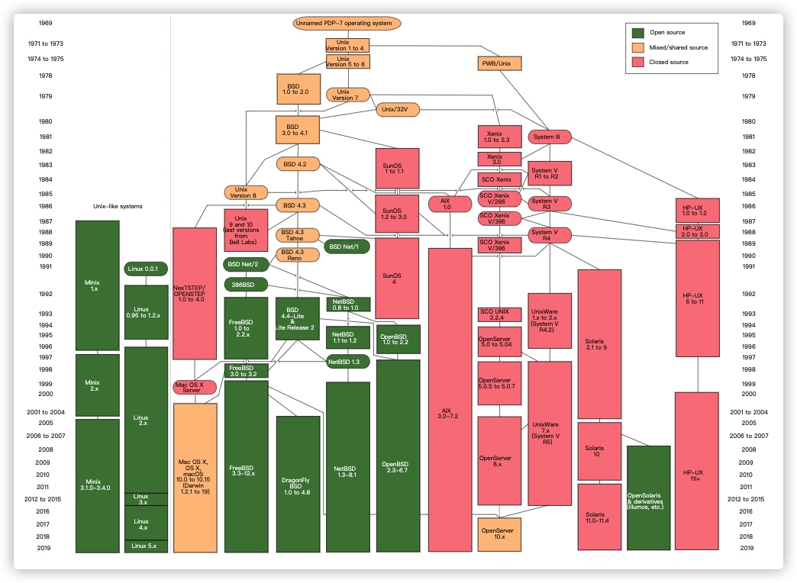

# linux 发展及历史
## linux与开源软件
  Linux 是一种自由和开放源代码的类UNIX操作系统，该操作系统由（林纳斯.托瓦兹）在1991年首次发布，再加上用户空间的应用程序，就成为Linux操作系统。Linux只是操作系统内核本身，但通常采用Linux内核 来表示，Linux完整操作系统包括GUI组件和许多其他实用工具。
     GNU通用公共许可协议（GNU Grneral Public License,GNU GPL或GPL），是一个广泛使用的自由软件许可协议条款，最初由理查德.斯托曼为GNU计划而拟写，GPL给出了计算机程序自由软件的定义，任何基于GPL软件开发衍生的产品在发布时必须采用GPL许可证方式，且必须公开源代码。
    Linux 是自由软件和开放源代码软件中最著名的例子，只要遵循GNU  GPL，任何人和机构都可以自由地使用Linux的所有底层源代码，也可以自由地修改和再发布，随着Linux操作系统飞速发展，因此L名词；

## Linux发展路线图

## linux在服务器领域的发展
Linux服务器操作系统在整个服务器操作系统市场格局中占据了越来越多的市场份额，已经形成了大规模市场应用的局面，并保持着快速的增长率，尤其在政府、金融、农业、交通、电信等国家关键领域。 Windows   server  linux 
据权威部门统计，目前Linux在服务器行业领域已经占据85%的市场份额。

## Linux在桌面领域的发展
Linux 桌面操作系统的发展趋势非常迅猛，国内如：中标麒麟Linux、红旗Linux、深度Linux等系统厂商都推出的Linux桌面操作系统， SUSE、Ubuntu  Kali
## Linux在云计算/大数据的发展
互联网产业的迅速发展，促使云计算、大数据产业的形成并快速发展，云计算、大数据作为一个基于开源软件的平台，Linux占据了核心优势。
## linux操作系统特点
1. 开放性
   Linux操作系统的兼容性很高，遵循世界标准规范，特别是开放系统互联（OSI）国际标准，而微软的视窗操作系统源代码基本保密；
2. 多任务
   在多核处理时代，Linux操作系统的一大优势是：系统调度的每一个进程都可以平等的访问微处理器，而因为CPU的处理速度非常快，所以各个应用程序看起来就像同时运行的。
3. 多用户
   Linux是一个多用户操作系统，系统资源可以被不同各自拥有使用，而没有用户对自己的资源（例如文件、设备）都有特定的权限，互不影响。 
4. 设备独立性
   Linux可以把所有外部设备统一当做文件，只要安装相关的驱动程序,任何用户都可以像文件一样使用这些设备。另外，用户可以免费得到Linux的内核源代码，这样，用户变可以自己修改操作系统的内核源代码，以适应新增加的外部设备。
5. 提供丰富的网络功能
   一般的操作系统并没有内资的网络连接功能，也不具备联网的灵活性。而Linux操作系统具有完善的与内核结合在一起的网络功能，在通信和网络功能方面优于其他操作系统。
6. 费用低廉
   与微软的Windows操作系统相比，Linux系统的使用费用几乎可以忽略。由于Linux基于GPL，系统本身免费，而且不少发行套件包含了丰富的应用软件，基本上都可以满足大多数用户的使用需求。
