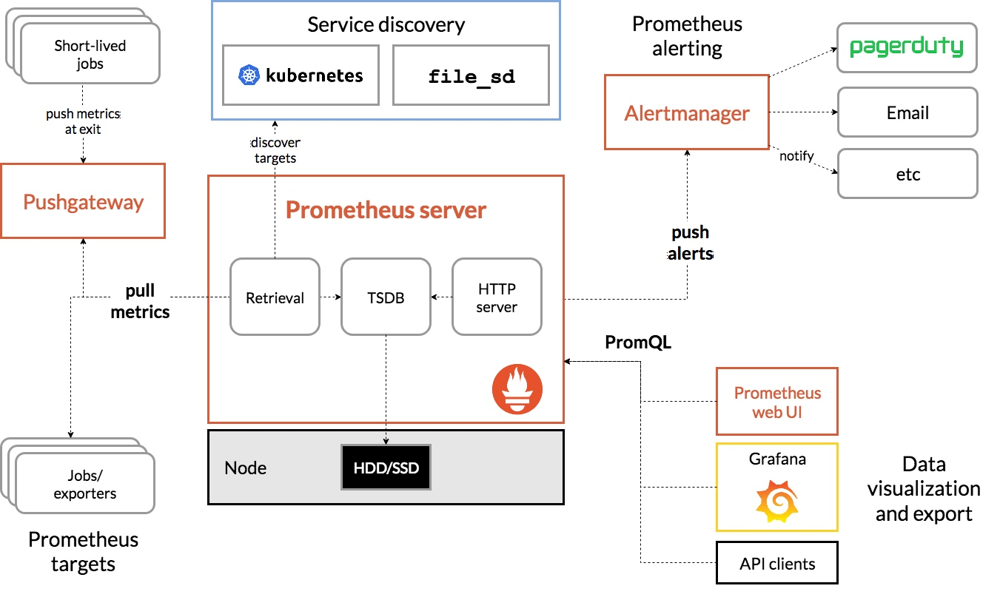
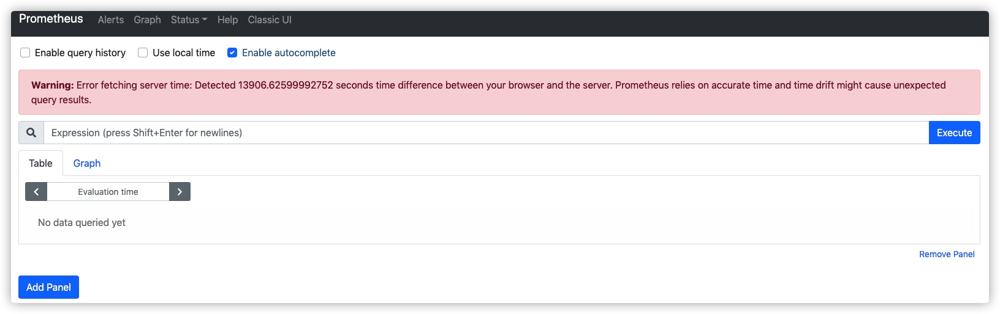
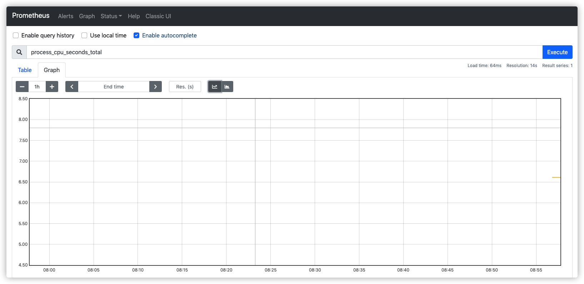

# prometheus（普罗米修斯） 
[官方帮助手册](https://prometheus.io/docs/introduction/overview/)
#### 介绍
Prometheus是最初在SoundCiloud上构建的开源系统监视和警报工具包 。自2012年成立以来，许多公司和组织都采用了Prometheus，该项目拥有非常活跃的开发人员和用户社区。现在，它是一个独立的开源项目，并且独立于任何公司进行维护。为了强调这一点并阐明项目的治理结构，Prometheus在2016年加入了 Cloud Native Computing Foundation，这是继Kubernetes之后的第二个托管项目。

#### 特征
普罗米修斯的主要特点是：
- 一个多维数据模型，其中包含通过度量标准名称和键/值对标识的时间序列数据
- PromQL，一种灵活的查询语言 ，可利用此维度 
- 不依赖分布式存储；单服务器节点是自治的
- 时间序列收集通过HTTP上的拉模型进行
- 通过中间网关支持推送时间序列
- 通过服务发现或静态配置发现目标
- 多种图形和仪表板支持模式
  
#### 组件
Prometheus生态系统包含多个组件，其中许多是可选的：
- Prometheus主服务器，它会刮取并存储时间序列数据
- 客户端库，用于检测应用程序代码
- 一个支持短期工作的推送网关
- 诸如HAProxy，StatsD，Graphite等服务的专用出口商
- 一个alertmanager处理警报
- 各种支持工具
  
大多数Prometheus组件都是用Go编写的，因此易于构建和部署为静态二进制文件。

#### 软件架构
下图说明了Prometheus的体系结构及其某些生态系统组件



## 安装教程
##### 下载Prometheus
 为您的平台[下载最新版本](https://prometheus.io/download/)的Prometheus，然后解压缩：
 ```
 # tar xf prometheus-2.23.0.linux-amd64.tar.gz
 # cd prometheus-2.23.0.linux-amd64
 ``` 
Prometheus服务器是一个称为prometheus（或prometheus.exe在Microsoft Windows上）的二进制文件。我们可以运行二进制文件，并通过传递--help标志来查看有关其选项的帮助

```
 # ./prometheus --help
usage: prometheus [<flags>]
The Prometheus monitoring server
Flags:
  -h, --help                     Show context-sensitive help (also try --help-long and --help-man).
      --version                  Show application version.
.......      
```

启动Prometheus方式有两种；默认端口号是9090
```
# ./prometheus  #这样执行的话会占用的终端，
# ./prometheus &  #&可以放置后台运行
```
#### 配置防火墙规则
```
# firewall-cmd --permanent --add-port=9090/tcp
# firewall-cmd --reload
```
普罗米修斯应该开始。您还应该能够在http：// localhost：9090上浏览到有关其自身的状态页面。给它大约30秒的时间，以从其自己的HTTP指标终结点收集有关其自身的数
##### 如果访问到页面上显示Warning的错误话，很有可能是时间错误的问题
 
设置系统时间
```
# date -s "20201215 16:56:35"
```
#### 时间正确了就可以查询到信息


### 配置Prometheus

```
global:
  scrape_interval:     15s
  evaluation_interval: 15s

rule_files:
  # - "first.rules"
  # - "second.rules"

scrape_configs:
  - job_name: prometheus
    static_configs:
      - targets: ['localhost:9090']
```
有示例配置文件中配置的三个模块：global，rule_files，和scrape_configs。
global块控制Prometheus服务器的全局配置。我们有两个选择；
- scrape_interval控制，Prometheus多久刷新一次目标。您可以为单个目标覆盖此目标。在这种情况下，全局设置是每15秒刷新一次。
- evaluation_interval选项控制Prometheus多久评估一次规则。Prometheus使用规则来创建新的时间序列并生成警报。
- rule_files块指定了我们希望Prometheus服务器加载的任何规则的位置。目前，我们还没有任何规则。
scrape_configs控制Prometheus监视哪些资源？
- 由于Prometheus还将有关自身的数据公开为HTTP端点，因此它可以抓取并监视其自身的运行状况。在默认配置中，prometheus它会刷新Prometheus服务器公开的时间序列数据。作业包含一个静态配置的目标localhost端口9090。Prometheus希望指标可用于路径上的目标/metrics。因此，此默认作业是通过以下网址进行抓取：http：//localhost：9090/metrics。
返回的时间序列数据将详细说明Prometheus服务器的状态和性能。


-------


